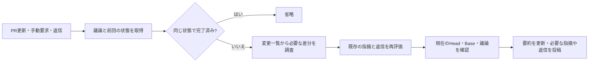

# 入力を制限し、議論を引き継ぐレビュー

## 解決する問題

ツールを使うレビューでは、差分を一度送るだけでなく、過去のツール出力を後続の要求でも送る。
大きなビルドログや生成物を検索した結果を保持し続けると、1回の調査でも入力が増え続ける。
要求回数の制限と429の再試行だけでは、この増幅を防げない。

また、毎回新しいレビューを投稿すると、同じ問題が複数のスレッドへ分かれ、修正への返信や
判断の変更を追いにくくなる。計算量の削減と、指摘の継続的な管理を一緒に扱う。

## CodeRabbitの公開仕様から確認できること

2026-09-18時点の公式文書を参照した。以下は製品の公開された振る舞いであり、内部実装の再現ではない。

| 観点 | 確認できる仕様 | このActionの対応 |
| --- | --- | --- |
| 更新時の範囲 | 前回のレビュー以降のコミットを対象にする増分レビュー、手動の全体レビュー | 前回の完了Headを差分基点にし、全体比較への切り替えも提供 |
| 実行頻度 | Draftの既定除外、レビュー済みコミット数による自動一時停止 | 利用側でDraftを自動レビュー対象外にし、完了済みの同一状態を省略。回数による自動停止は未実装 |
| 議論 | コメントで説明・反論・代案をやり取りし、PR内のコードや過去のコメントを参照 | PR本文、既存スレッド、返信を取得し、現在のコードを再確認 |
| 指摘の追跡 | 過去の指摘を再評価し、解消に応じてレビュー状態を更新 | スレッドIDによる関連付け、状態の再評価、要約の更新。自動resolveは行わない |
| キャッシュ | 準備済みリポジトリ・依存関係のスナップショット | モデル入力の上限制御を実装。独自のプロンプトキャッシュは未実装 |

出典: [自動レビューと増分レビュー](https://docs.coderabbit.ai/configuration/auto-review)、
[レビュー中の会話](https://docs.coderabbit.ai/guide/chat)、
[変更要求のワークフロー](https://docs.coderabbit.ai/pr-reviews/request-changes-workflow)、
[キャッシュ](https://docs.coderabbit.ai/reference/caching)。

CodeRabbitは会話からのLearningsも提供しており、PR内の生の会話とは別に適用範囲を持つ。
このActionはPR内の議論だけを使い、コメントを別PRへ持ち越すルールにはしない。
[公式Learningsの説明](https://docs.coderabbit.ai/knowledge-base/learnings)を参照。

公開文書からは、正確なプロンプト、モデルごとのトークン予算、コンテキスト選択順位、
LLM応答のキャッシュキー、同一指摘を照合する内部アルゴリズムまでは分からない。
リポジトリ環境のキャッシュを、LLMへの入力が不要になる仕組みとは解釈しない。

## 処理の流れ

### 1. モデルへ渡す前に範囲を決める

`context` Actionは読み取り専用トークンで、対象PRと同一リポジトリのHeadを確認する。
最大3ページのGraphQL取得で、PR本文、20スレッドまでの元コメントと直近5件の返信、
一般コメント10件までを30KB以内のJSONにする。人間の議論とスレッドの状態からdigestを作る。
自分の生成本文はdigestから除外し、投稿しただけで次のレビューが必要になる循環を避ける。
スレッドの追加・resolve・outdatedの変化は含める。

件数・本文・ページ数による省略はすべて`truncated`として明示する。
「取得できたものだけ見て全体を確認済みにする」ことを防ぐため、省略があるレビューは
未完了となる。長大な議論を持つPRは人間の確認が必要になるという運用上の制約がある。

前回のHeadは、同じBase・レビュー方針で完了したレビューからのみ再利用する。Git上でそのHeadが現在の
祖先であることも確認し、force pushや履歴不足の場合は通常のPR差分へ戻す。
増分だけを読む場合も、未解決の過去の指摘に関わるコードは調べ直す。

### 2. 入力と出力の両方に上限を設ける

最初の差分ツールは変更ファイルと行数の一覧を返す。実際のパッチはファイルと行範囲を指定し、
最大400行ずつ取得する。一覧自体もページ化する。ビルドや検索の出力は先頭・末尾を残して
約6KBに制限し、省略を明示する。モデルには生成物や依存関係全体の広い検索を避けるよう指示する。

モデルへ送る会話と観測の保管場所を分離する。送信時に残すのは最初の依頼と直近4往復の
会話、および最大6KBの調査索引であり、古いツール出力・モデルの説明や思考を毎回送り直さない。
残す会話はツール呼び出しと応答の組を保ち、必要なプロバイダー署名もそのまま保持する。
各ツール出力の入力上限は約6KBで、直近2件より古い保持対象の出力は500バイトに短縮する。

観測の詳細は実行中のメモリに保持する。`read_observation()`で索引を5件ずつ、
`read_observation(step_id=..., start_char=...)`で必要な結果を1000文字ずつ取得できる。
元の観測IDを使い、コマンドを再実行したり新しい観測を偽造したりしない。
索引はツール名・引数等の所在情報であり、古い出力を見たことの代わりにはならない。
過去の観測は実行時点の記録なので、その後のコマンドがファイルを変えた場合は新しい閲覧が必要になる。
独立した要約モデルによる追加の入力消費は発生させない。

調査の途中の結論まで失わないよう、モデルは`save_review_notes`で根拠ID付きの短い作業メモを
更新できる。候補となる指摘、確認した結論、未確認の疑問を残し、古いメモは置き換える。
本文は4KB、送信ブロックは6KB以内とし、ログの貼り直しは求めない。
メモはモデルの仮説であり、観測の代わりや確定した判定としては扱わない。

履歴・ツール定義・指示・設定を直列化して、既定で1要求96,000バイト、直近60秒で
384,000バイトまでに制限する。出力は8,192トークンまで。これらの入力バイト数は
プロバイダーのトークン数や実際のHTTPボディサイズと同一ではない。
成功した応答の実トークン使用量もログに出し、運用上の検証と調整に使う。

429・502・503は最大3試行、最低5秒の要求間隔、1要求180秒までの待機で扱う。
サーバー指定の待機時間を尊重し、失敗した試行も入力予算へ計上する。
SDK独自の再試行を止め、再送によりツールの副作用が再実行されることを防ぐ。
429が続く場合や入力・待機予算を超えた場合は、承認できない未完了レポートへ変換する。

GeminiのTPMは入力トークンの制限であり、RPM等と別に評価され、プロジェクト全体で共有される。
本実装は1プロセス内の制御なので、別PRや別アプリも同じプロジェクトを使う場合の
合計流量までは保証できない。[Googleのレート制限](https://ai.google.dev/gemini-api/docs/rate-limits)。
複数利用者の流量が問題になる場合は共有キュー等が必要になる。APIキーを増やすだけでは分離できない。

### キャッシュの種類と無効化

| 保持するもの | 再利用の範囲 | 無効化・更新 |
| --- | --- | --- |
| ツールの観測結果 | 同じレビュー実行内。観測IDで必要なページだけ取り出す | 実行終了で破棄。別のcheckoutの現況として再利用しない |
| 完了したレビューの状態 | 同じPR、Head/Base、議論digest、Draft状態、policy_digest | いずれかが変化した場合、または未完了・省略がある場合はスキップしない |
| 差分の基点となる前回Head | 同じBaseと方針で完了した前回レビュー | 方針変更、Base変更、非祖先なら全体比較へ戻す |
| プロバイダーのプロンプトキャッシュ | 安定した指示やツール定義等の共通prefix | プロバイダーの仕様に従う。自前の明示キャッシュは作成しない |

`policy_digest`はダウンロード済みのAction実装、内部の方針バージョン、必須入力`review-profile`から生成する。
実装の識別子には、Action定義・実行コード、`src`のPythonコード、サンドボックスのDockerfileと
シェルスクリプト、`pyproject.toml`・`uv.lock`の相対パスと内容を、順序を固定してハッシュ化する。
参照名や最新コミットをAPIで調べる方式ではないため、`@main`の名前が同じでも取得した実装が
変われば再利用しない。必須ファイルの欠落はエラーとし、生成物、ドキュメント、テスト、隠しファイルや
環境変数の認証情報は実装ハッシュの対象にしない。
取得した実装のハッシュは`source_digest`として議論JSONにも含める。調査と投稿は、実行前に
自身の実装とこの値を照合する。`@main`がジョブ間で更新されて異なる実装を取得した場合は、
古い前提でモデルを呼び出したり完了状態を保存したりせず、新しい議論取得からやり直す。
`review-profile`にはモデル、言語、入力・出力・回数上限、MCPやルールの識別情報を含め、
利用側の設定が変わったら更新する。トークンや秘密鍵自体は含めない。
古い形式の状態や異なる方針では、増分基点も完了済みスキップも利用しない。

外部IssueやMCP文書の更新は、PRの議論digestだけでは検知できない。
それらの最新版を改めて確認する場合は全体レビューを明示するか、方針の識別子を更新する。
省略のある議論を「同じ内容」とみなしたり、途中の失敗を完了結果として保存したりしない。

Geminiの暗黙キャッシュは対応モデルで自動適用される。安定したprefixを保ち、応答の
cache使用量をログで確認する。一方、キャッシュ済みトークンもトークン制限に含まれるので、
不要なログ全体をキャッシュするだけではTPM対策にならない。
明示キャッシュを将来導入する場合も、固定のコード・規約など繰り返し必要な資料に限定し、
モデル・内容hash・アクセス範囲・TTLを管理する。会話全体をキャッシュする方式は採らない。
[GoogleのGenerateContentキャッシュ仕様](https://ai.google.dev/gemini-api/docs/generate-content/caching)。

### 3. 既存の指摘を再評価する

各スレッドを`fixed`・`still_present`・`uncertain`で評価する。修正したという返信は調査の
手掛かりであり、修正の証明ではない。`fixed`と`still_present`には現在のコードの根拠を求める。
ファイル一覧や会話だけでレビューを完了することも認めない。
コメントとリポジトリの内容は調査資料であり、レビュー方針を上書きする指示として扱わない。

モデルが既存の問題を再報告する場合は`existing_thread_id`を付ける。投稿側はGitHubで
スレッドの所属PRと元コメントの投稿者を照合し、他者のスレッドを自分の指摘として更新しない。
意味の一致の判定はモデルに依存するため、言い換えられた同じ問題の重複を完全には保証できない。
同一本文の再試行はマーカーで抑止する。

### 4. 投稿を継続的な状態として扱う

要約コメントを1つ更新し、既存の指摘へのリンクと再評価を載せる。正式なPR Reviewは
新しい指摘、判定の変化、新しいHead・Baseへの承認が必要なときに投稿する。
同じ状態の指摘を言い換えただけでは返信せず、人間の返信や状態に変化があるときに応答する。
途中で投稿に失敗した場合も、投稿済みマーカーを読み、同じ指摘・返信の重複を抑止する。

投稿前にHead・Base・PRが開いていることを確認する。調査後に人間の議論が変わっていたら、
修正済みという判断や承認を保留する。読み取りと書き込みはGitHub上の単一トランザクションでは
ないため、最後の確認直後に変更が起きる極小の競合窓は残る。

既存スレッドの自動resolveや過去の変更要求の自動dismissはしない。
`COMMENT`は過去の`REQUEST_CHANGES`を取り消さない。問題解消後の新しい承認、または人間の
操作が必要になる。手動dismissだけで同じコード・議論を自動再承認しない。
再調査が必要な場合は`full-review: true`で明示的に実行する。

### GitHubへ投稿する本文の上限

要約・正式なレビュー・インライン指摘・返信のそれぞれに、完成後のUTF-8本文で
60,000バイトの予算を適用する。日本語や絵文字、HTML/Markdownのエスケープ、URL、
実行マーカーと状態JSONを付けた後のサイズで検証する。
GitHubの公式Agentic Workflowsでも、フッターを含むコメント全体に65,536文字の制約を
設けている。本Actionはそれより保守的なバイト上限を使う。
[GitHubの関連仕様](https://github.github.com/gh-aw/specs/safe-outputs-specification/)。

超過時は調査の詳細ログから省略し、実行ログへのリンクへ置き換える。
さらに削減が必要な場合は各説明を明示的な抜粋にする。省略前に元のレポートをJSONとして
実行ログへ保存し、改行をエスケープしてrunner命令として扱われないようにする。
重大度・指摘タイトル・場所・判定・未完了の状態・既存スレッドへのリンクは保持する。
本文全体を途中で切る処理は使わず、Markdownや状態マーカーを壊さない。
サイズを小さくしたこと自体を理由に、未完了を完了へ変えたり変更要求を承認へ変えたりしない。

## イベントと権限

最小構成はREADMEのPR更新イベント例。返信・手動実行を追加する場合は、次の分離を維持する。

| ジョブ | 入力・権限 | 役割 |
| --- | --- | --- |
| prepare | `contents: read`、`pull-requests: read`。モデルキー・投稿キーなし | イベントの対象判定、同一リポジトリの未完了PRを確認、議論を取得 |
| analyze | `contents: read`とGeminiキー | 指定Headのcheckout、入力制限付きモデル調査。GitHub投稿権限なし |
| publish | PR書き込み用Appトークン | 対象番号・調査時Head/Baseを照合、JSONを検証、投稿。checkoutとモデルキーなし |

利用側ワークフローでは、Bot以外のOWNER・MEMBER・COLLABORATORによる
自分のBotスレッドへの返信、`/ai-review`、`/ai-review full`だけを手動調査の起点にする。
一般コメントをすべて実行の起点にせず、本文をシェルへ埋め込まない。
`workflow_dispatch`ではPR番号と全体レビューの選択を受け取り、同じ対象チェックを通す。
Draftは自動実行から除外し、必要なら手動実行で調査する。Draftの承認は行わない。

これらのコメント・手動トリガーは利用側での実装が必要で、Action自体がイベントを登録するわけではない。
`issue_comment`・`workflow_dispatch`を導入した後は、デフォルトブランチへの反映も確認する。

競合制御は対象判定後のanalyzeとpublishにPR番号単位で設定する。ワークフロー全体を
コメントイベントで取り消すと、Bot自身の投稿や無関係なコメントまで実行中の調査を取り消し得る。
analyzeは新しい対象実行で置き換え、publishは途中で取り消さず直列化する。
全PRで1つのGitHub concurrencyグループにまとめるだけでは、保留中の別PR実行が置き換わるため、
プロジェクト全体の公平なキューの代替にはしない。

## 検証の範囲

単体テストでは入力バイト制限・履歴の短縮・待機時間・429回復と打ち切り・再試行時の
ツール非再実行、実Gitの差分ページ化、議論だけでは完了できないことを検証する。
contextとpublishのテストではページ上限・古い状態・改変されたスレッドID・返信の追加・
同一判定・投稿途中の失敗・新しいコミットへの承認を検証する。

これらはモデルによる意味判断の正しさや、本番プロジェクト全体のTPM余裕を証明するものではない。
導入後は実際のinput/outputトークン数、429頻度、未完了率、重複指摘、返信の内容を確認する。
